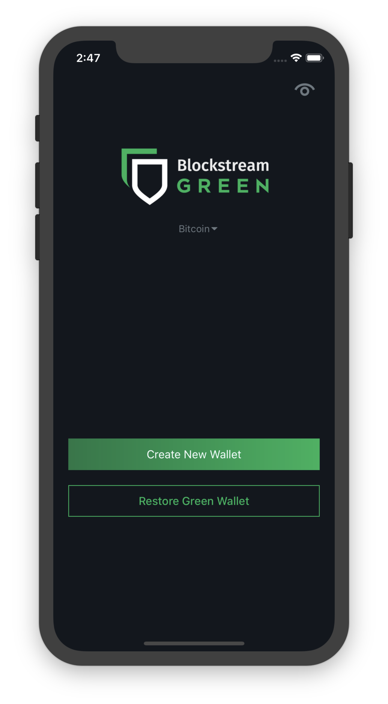

----------
Logging In
----------

Lost or Incorrect PIN
---------------------

.. warning:: If you have lost or forgotten your PIN, you will need to use your mnemonic to
   log in. We cannot tell our users their PIN because we do not store it on our database.

Keep in mind that each PIN is specific to the app installed on a particular device, and is
not universal across multiple apps that access the same wallet. The PIN that you use to
access your wallet from your iPhone is not necessarily the same as the PIN that you use to
access your wallet from your Desktop.

If the PIN is incorrectly entered three times in a row, the app will assume that a
malicious party is trying to gain access to the device, and will no longer accept attempts
to access by PIN. In this scenario, one must use their mnemonic to access their wallet on
that device.

App No Longer Accepts PIN
-------------------------

.. tip:: If your app no longer accepts your PIN, first check to see if the network
   selected in the middle of the landing page page is the correct one, i.e. you should
   see ``Bitcoin`` if you created the wallet and PIN on Bitcoin mainnet, or ``Liquid`` if
   it was a Liquid wallet. Select the correct network to have the app accept your PIN.

If the PIN login option is not available, then it means that your PIN has been reset, and
you will need to use your mnemonic to log in.

This can happen for a variety of reasons including (but not limited to):

- someone entering a PIN incorrectly 3 times in a row
- changes to the base operating system by mobile carriers/mod authors that introduce bugs
  or incompatibilities in the native PIN API
- bugs in the phone’s firmware (or networking stack after entering the PIN incorrectly
  only once)
- damage to the phone’s filesystem from physical shocks such as being dropped or getting
  wet
- settings being overwritten by malware
- incorrect or incomplete OTA system upgrades or app updates
- unexpected phone power loss

The remedy is the same regardless of the cause: you must use your mnemonic to log in again
.

Trouble Entering Mnemonic
-------------------------

When entering your mnemonic, enter the words all in lowercase. After you have typed all 24
words, you can press the submit button.

If you are trying to enter your mnemonic and it is not working, then one of three error
messages should appear.

Invalid Words
'''''''''''''

The first possibility is that one or more words are not valid under the mnemonic scheme
that we use. Typically, the words are just misspelled, and they are highlighted in red or
strikethrough.

Correcting or changing the erroneous word(s) may make your mnemonic correct again.

You can also find the list of valid words at:

`BIP39`_

.. _BIP39: https://github.com/bitcoin/bips/blob/master/bip-0039/english.txt

.. tip:: You may wish to try with similar looking words if one of your words is not
   written down clearly.

If you are missing a word or they are in the wrong order, then you will need to attempt to
recover them using a wallet recovery service or tool, but this is beyond the scope of
support that we can provide.

Also, make sure you are using the latest version of the wallet and that you are using
lower case (small letters) and no commas or other whitespace such as tab, leading or
trailing whitespace.

.. tip:: If you are copy and pasting your mnemonic into the text box, please try typing
   them as sometimes they may have been saved in an incorrect encoding.

Out of Order Mnemonic Words
'''''''''''''''''''''''''''

The second possibility is that the words that you have entered are valid words in the
mnemonic scheme, but that one of the words is incorrect (though still a valid word) or
they are in the wrong order. One or more of the words are incorrect, but the app doesn’t
know which one since they are all potentially valid words.

As with the previous error, you may wish to try and investigate which word(s) may have
been recorded incorrectly.

Not a Blockstream Green Wallet (GreenAddress) Mnemonic
''''''''''''''''''''''''''''''''''''''''''''''''''''''

The third possible error is that the mnemonic is valid, but it doesn’t match anything in
our database. There are several possible causes for this.

It can happen if someone tries to enter a mnemonic from their Blockstream Green testnet
wallet. The testnet and mainnet versions of the wallet are completely separate and
function on different networks.

Another possibility is that the mnemonic entered corresponds to a valid private key that
was generated by a Blockstream Green wallet, but that the wallet has since been deleted
by its owner.

Lastly, an error message will appear if someone is trying to restore a wallet that was
created by a separate service. Because Blockstream Green wallets use a special 2of2
multisig address type, mnemonics generated by other services aren’t compatible with our
system. (If you wish to move all coins from an existing non-Blockstream Green wallet into
a Blockstream Green wallet, then you can send them in a transaction, or use the sweep
function.)

Lost or Incorrect Mnemonic
--------------------------

.. tip:: If for some reason you have lost your mnemonic, or you suspect that your record
   of your mnemonic has been damaged or tampered with, and if you are still able to log
   into your wallet with a PIN, then you can view your mnemonic from the settings page to
   double-check or re-record them.

If, however, your wallet no longer accepts your PIN, which can happen for a variety of
reasons, and you have lost your mnemonic, we are unable to assist you in accessing your
wallet. In this situation, your coins may be permanently lost, unless you can recover your
mnemonic.

In the Bitcoin world, it is unfortunately common for users to erroneously record their
24-word mnemonic. One way to avoid this is to double-check that you have correctly
recorded by installing a fresh version of our app on a different device and then testing
it there to see if it works.

Lost Device or Accidental Uninstallation
----------------------------------------

If the only device you use to access your Blockstream Green wallet is lost or stolen, or
for some reason the program gets uninstalled or deleted, you will need to install a fresh
version of the app on some device, and use your mnemonic to restore your wallet.

Once the app is installed, do not choose the option create a new wallet. Instead, you can
restore your existing wallet by entering its mnemonic that you have already recorded.

After this, the app will ask you to create a PIN for that device. It can be the same as
the old one, or you can choose a new one.

.. tip:: This procedure can also be used if you simply wish to be able to access a single
   wallet from multiple devices.

Watch-Only Mode
---------------

Watch-only mode is a feature that allows the owner of a wallet to create an alternative
login method that can view the activity on a wallet without being able to change any
crucial settings or send coins.

This can be useful for situations if you want to let someone else access your wallet to
get a receiving address or confirm for you that coins have been received.

You can add a watch-only login under the “Network” section of settings. Select “Watch-Only
Login”, and then you can create the new username and password, and press save.

You can return and edit this anytime you are logged in as the wallet’s owner.

To log in with the watch-only login, you need to return to the ``Onboarding`` screen by
logging out of the main wallet. Then, instead of entering your PIN or mnemonic, tap or
click on the ``eye icon`` on the top right corner of the home screen.

This will prompt you to enter the username and password that you chose in settings, and
will grant access to a limited version of the wallet only for viewing transaction history,
receiving transactions, or sweeping a paper wallet or WIF private key.

.. tip:: You can safely give this username and password out to anyone else who you want to
   be able to view your wallet’s activity, without having to trust them not to steal -
   they will be unable to ever send coins out of your wallet using this login information.

Setup PIN and Touch/Face ID
---------------------------

Under Settings->Network, you can find an option that allows you to disable your PIN to log
in.

If you choose to disable the PIN login you will need to enter your full 24-word mnemonic
every time you wish to access your wallet on that device. This can be useful for a
situation where you suspect someone may have access to your device and may be able to
guess your PIN.

.. tip:: You can also quickly disable, and then immediately enable again as a method to
   change your PIN.

Depending on your phone, you may also have an option for Touch or Face ID, which can be
easily toggled on and off here.
