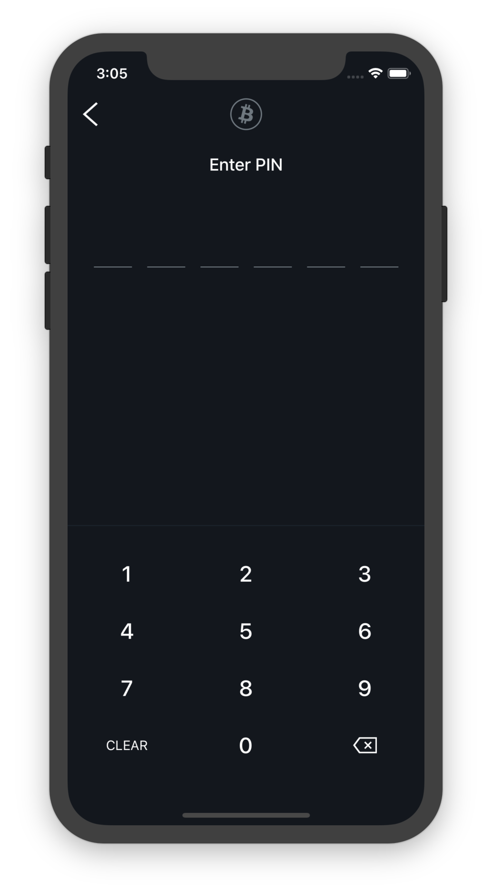
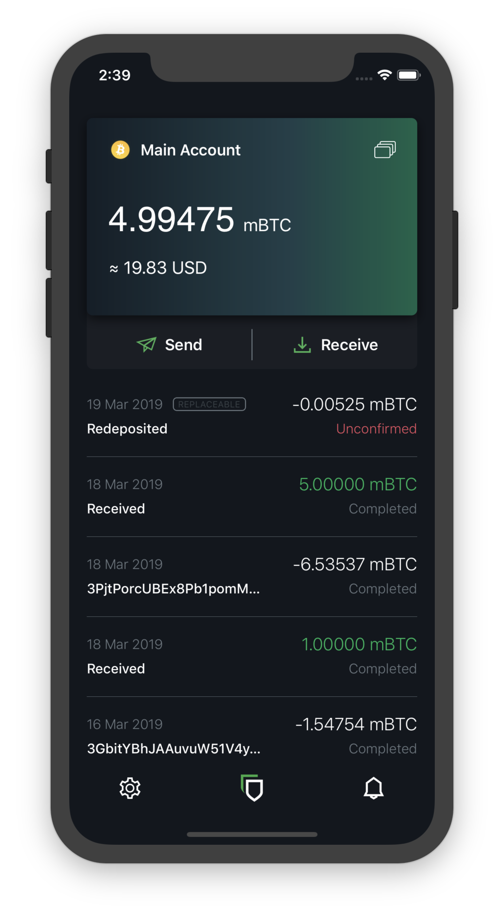
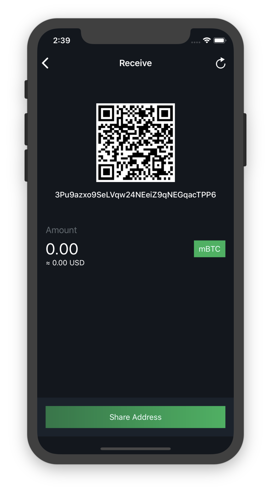
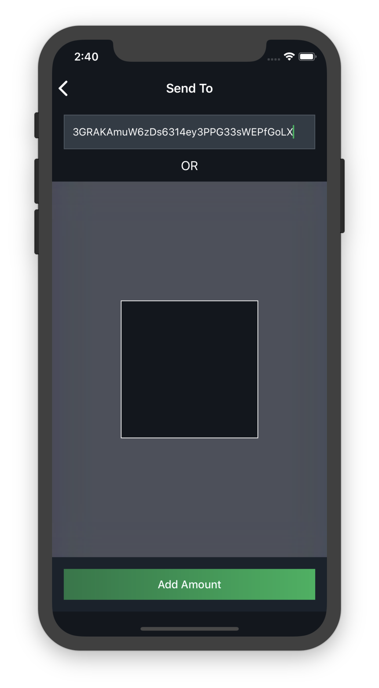
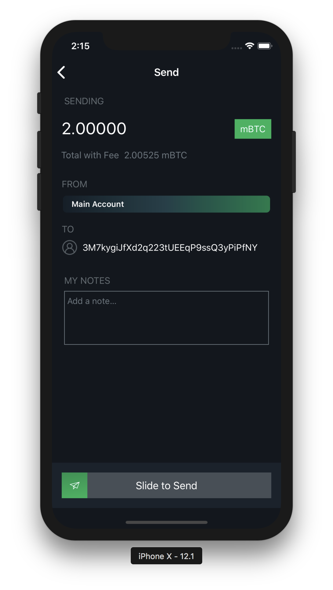

---
layout: default
title: Basic Usage
nav_order: 3
parent: GETTING STARTED
grand_parent: Green Wallet
--- 

- [Logging In](#logging-in)
- [Balance and Transaction List](#balance-and-transaction-list)
- [Receiving Transactions](#receiving-transactions)
- [Sending Transactions](#sending-transactions)
- [What Happens After a Transaction Is Sent](#what-happens-after–a-transaction-is-sent)
- [Our Multisignature Model](#our-multisignature-model)
- [Redeposits](#redeposits)

## Logging In

After you have created your wallet, you will be presented with a login screen when you open the app.

Here, you can enter your PIN, which will grant you access to your wallet. This will work in the vast majority of situations.

If you have forgotten your PIN, you will need to enter your 24-word mnemonic to access your wallet. After you have done this, you will be prompted to create a new PIN to easily access the wallet you just restored.

You will also need to access your wallet with your mnemonic if you or someone else has incorrectly entered your PIN 3 times in a row. In this scenario, your app will reset your PIN and require your mnemonic. This is a security feature to prevent a malicious party from continually guessing your PIN until they get it right.

## Balance and Transaction List

The main screen you’ll be using in Blockstream Green will display your wallet’s balance in Bitcoin and its approximate value in your selected fiat currency.

Directly below this will be the send and receive buttons.

You can also view from this screen all of your wallet’s incoming and outgoing transactions. Transactions are listed in reverse chronological order, starting with the most recent transactions at the top.

You’ll be able to see the date, time, amount (in Bitcoin and fiat currency), and confirmation status of any transactions. You can also select any transaction to get more information about it, such as its Transaction Hash, which can be used as a proof-of-payment.

## Receiving Transactions

To receive Bitcoin, all you need to do is provide a receiving address to the sender.

A Bitcoin receiving address is a string of numbers and letters. You can create a receiving address by selecting “Receive” from the main screen. Your wallet will generate a new receiving address each time you prompt it for one. While it is possible to reuse old addresses, we strongly advise against this because it lessens your privacy.

Once you can see what your new address is, you’ll need to communicate it to the sender. If you need to send over a distance, a text message or email is an effective way to do it. It’s always better to copy and paste addresses rather than manually type them out, and you should also double or triple check every time, especially for larger amounts. If the address is wrong, any bitcoins sent can become lost forever, so be very careful!

If you are physically beside the person who will be sending you Bitcoin, another option is to use the QR code, which the sender can scan to get the receiving address. This is really convenient if the sender is using a mobile wallet.

Once someone has sent a transaction to your Blockstream Green wallet, it should appear in your transaction list page. At first, it will be labelled “unconfirmed”. At this point, you should not consider the coins to have been received, because the transaction may still get overwritten or canceled. The transaction will over time accumulate “confirmations” as new blocks are mined in the Bitcoin network. Once your transaction reaches 6 confirmations, your wallet will list it as “confirmed” and you can consider the coins received.

## Sending Transactions

To send a transaction, select “Send” from the main screen.

You will need to get the receiving address from the recipient, and enter it (either by typing or pasting it in, or by scanning the receiver’s QR code).

Then, you can input the amount of Bitcoin that you want to send, and hit send.

Your wallet will also automatically calculate a fee for your transaction, which is necessary to have the network accept it.

After you have sent a transaction, you need to wait for the network to confirm it, which can take a bit of time. You can check the status of a transaction by looking into your transaction history on the main screen.

## What Happens After a Transaction Is Sent

Many new users sometimes wonder why they need to wait for Bitcoin transactions to complete. Why don’t they happen instantly?

This is because after the transaction has been sent, the sender and receiver’s jobs are done, but there are still several steps that need to be completed behind the scenes.

To become confirmed, a transaction needs to be included in a block. Blocks are created every 10 minutes on average, but this is only an average, and can vary from time to time. Sometimes blocks are found much more quickly (several within a minute) or much slower (can take over an hour).

Depending on how busy the network is, and how high a fee the sender paid, the transaction may not be included in the next block.

Once the transaction has been included in a block, it has 1 "confirmation". Every block mined after that earns it another confirmation. The industry standard is to wait for 6 confirmations before considering a transaction to be confirmed, at which point you can be confident that it has been received and can not be reversed or redirected. You will be able to see the confirmations accumulate on your wallet's default screen.

## Our Multisignature Model

Blockstream Green wallets use a special transaction format different from most other Bitcoin wallets.

Most other storage services in Bitcoin are either “custodial” or “non-custodial without 2FA security”.

Custodial services, such as exchanges, hold your Bitcoin for you. This also means that they can confiscate your coins at will, or if they get hacked, your coins can get stolen. It also usually means KYC identification, and risks of privacy loss.

Other non-custodial wallets do not have those issues, but it also means that if someone steals your mnemonic or gain access to your wallet, they can steal all of your coins. The secrecy of your mnemonic is the only thing protecting your coins with these wallets.

With Blockstream Green, you get the benefits of both types.

This is possible because coins in Blockstream Green wallets have two different spend conditions.

The first way to spend coins is using signatures from 2 different keys to send coins. One is held by the user in the form of the mnemonic, which the service  never knows. The other is stored on our server, and we sign your transactions with it after any 2FA you have enabled verifies the transaction.

This means that, unlike custodial solutions, we can never steal your coins, since we don't know your mnemonic. Even if we get hacked, or taken over by a government entity, or something else catastrophic happens, no one can steal your coins.

On the user side, even if someone steals your mnemonic, they cannot spend your coins unless they can access your 2FA. This is the type of security that other wallets do not offer.

The second way to spend coins becomes available after your two factor recovery period expires. Once this happens,  you can spend your coins without our service needing to also sign. This is to ensure that no matter what happens, you can always get your coins back.

Our signature scheme also allows us to enforce 2FA security, 2FA spending thresholds, and other extra options. These features do not exist in typical Bitcoin wallets.

## Redeposits

As explained above, coins in your main Blockstream Green wallet (or a 2of2 simple account) require 2 signatures to be spent: one from you and one from Blockstream Green. In order to protect you from loss of access to your coins should Blockstream Green become unavailable, there is an alternative spend condition which requires only the user’s signature, provided that a certain period of time has passed.

If the service becomes unavailable, you simply wait for the specified period (90 days by default), then sign and send the transaction using our open source recovery tool garecovery.

After the expiry period passes, any other limits placed on your spending in Blockstream Green, such as 2FA requirements, cease to be enforceable by the service.

At this point the wallet will prompt you to redeposit the coins by sending them to yourself (If you don’t log in to the wallet during this time, and you have email notifications enabled, the service will email you a reminder as the expiry date gets closer). The creation of the redeposit transaction resets the expiry period, thereby re-protecting the coins by once again requiring a Blockstream Green signature to spend them.

Keep in mind that this redeposit transaction is a regular Bitcoin transaction, and as such is subject to the usual transaction fees for the miners.

You can also adjust the expiry period in your settings if you wish it to be longer or shorter. A shorter expiry means you need to redeposit more often to maintain your 2FA security but don’t have to wait as long to recover; a longer expiry lets you redeposit less often, but you have to wait longer if your 2FA becomes inaccessible.
