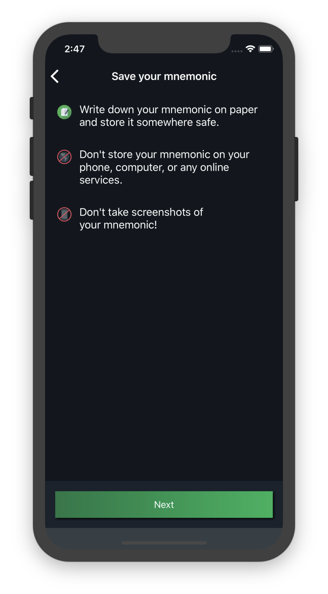
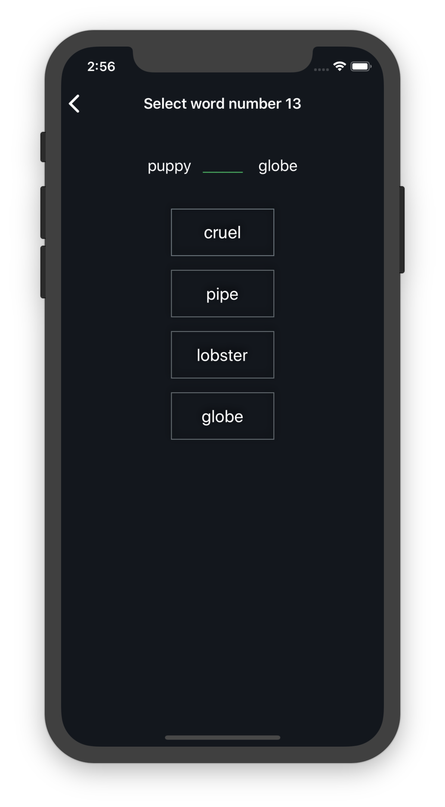

-------------------
Setting Up a Wallet
-------------------

Install the app
---------------

Blockstream Green apps can be accessed through the following operating systems and apps:

.. table::
   :widths: auto
   :align: center

   ===========================  ======================================
   Operating Systems Supported           Native Applications					
   ===========================  ======================================
           Android              `Blockstream Green Android Wallet`_
             iOS                `Blockstream Green iOS Wallet`_
   ===========================  ======================================

.. _`Blockstream Green Android Wallet`: https://blockstream.green/android
.. _`Blockstream Green iOS Wallet`: https://blockstream.green/ios

Each of our apps can also be used on Bitcoin’s testnet, which we recommend for testing new
features or becoming accustomed with the setup process to avoid accidental loss of coins.

Create and Safely Record Your 24-Word Mnemonic
----------------------------------------------

After you’ve installed the app, you’ll have the option to log in with an existing mnemonic
, or create a new wallet. To start, make sure the Bitcoin network is selected and click on
``Create New Wallet``.

.. image:: ../green-assets/landing.png
   :width: 250
   :align: center
  
At this point, the app will generate a 24-word mnemonic to function as a backup login
method for your wallet. (Our wallets use `the BIP39 standard`_ for generating your
mnemonic and BIP32_ to derive private keys from that mnemonic).

.. _the BIP39 standard: https://github.com/bitcoin/bips/blob/master/bip-0039.mediawiki
.. _BIP32: https://github.com/bitcoin/bips/blob/master/bip-0032.mediawiki

  
.. danger::
   **Your mnemonic is the single most important piece of information associated with your
   wallet.**

   **You must write it down somewhere safe and secret - it’s your ultimate backup.**

It must be kept safe and accessible because if your app gets uninstalled, or your device
gets lost or stolen, or you forget your PIN, or your PIN gets reset, then your mnemonic
will let you access your coins again. Even if we at Blockstream Green get shut down or
disappear, you can still retain control of your coins as long as you have your mnemonic.

It must be kept secret because if someone else can figure out or steal your mnemonic, they
may be able to steal your coins (although if you have *Two-Factor Authentication* set up,
they will need to bypass that as well...but we’ll cover that in the `Two-Factor
Authentication section`_ ).

.. _`Two-Factor Authentication section`: ../troubleshooting-advanced/
   troubleshooting-advanced-index.html#two-factor-authentication

To ensure that you safely recorded your mnemonic, you will be prompted to re-enter several
of the words in the correct order.

  
.. warning:: Remember:
   **we don't store your mnemonic in the Blockstream Green database, so we are not able to
   tell what it is if you lose it.**

.. warning::
   It is also crucial to **never** send your mnemonic over email or text to anyone (
   including Blockstream Green support).
  
   Doing so can expose your mnemonic to theft, and put your coins at risk. If you ever
   forget and accidentally do this, we urge you to create a brand new wallet as soon as
   possible and move your coins to that new wallet.

Choose a PIN for the Device
---------------------------

After you have recorded and confirmed your mnemonic, you will be able to choose a PIN.
This is a 6 digit number that can be used to quickly access your wallet on that device.

.. image:: ../green-assets/PIN-create.png
   :width: 250
   :align: center
  
In addition to the PIN you may also use iOS TouchID or Android’s Authentication to ease
access to the wallet you just created or restored. You can set this up from settings.

.. warning::
   It is important to keep your PIN safe and secret. If it is lost, your only option to
   re-access your wallet will be through your mnemonic.

Your PIN is specific to the device that it is created on. It is possible to access your
wallet from multiple devices by using your mnemonic, but you will create a separate PIN
for each device, so they might not be the same.

As a security feature, your device will reset your PIN if you or someone else enters the
wrong PIN three times in a row. This is to prevent a malicious party from continually
guessing until they get your PIN right.

If your PIN is reset, you will need to enter your mnemonic through ``Restore Green
Wallet`` on the "Onboarding" screen, which will allow you to create a new PIN for that
device.

.. image:: ../green-assets/landing.png
   :width: 250
   :align: center

Set up Two-Factor Authentication
--------------------------------

Finally, after you have recorded and confirmed your mnemonic and set your PIN, you will be
prompted to choose a *Two-Factor Authentication* method. A *Two-Factor Authentication*
method is a second layer of security that a
wallet’s owner must confirm before sending coins or making other critical changes in
settings.

.. image:: ../green-assets/2fa-setup.png
   :width: 250
   :align: center

.. tip::
   While optional, we urge you to activate at least one *Two-Factor Authentication* method.
   Ideally, you should add at least 2 different *Two-Factor Authentication* options.

For various reasons, our users sometimes lose access to one of their *Two-Factor
Authentication* methods, and this can be very inconvenient.
  
.. tip::
   You can mitigate this risk by having at least 2 different *Two-Factor Authentication*
   methods in place.
  
   This way, if you suddenly lose access to one, you can still retain full access to your
   wallet, and then reset the lost *Two-Factor Authentication* method (for more details on
   this, see the section for `changing a Two-Factor authentication method`_).

.. _`changing a Two-Factor authentication method`: ../troubleshooting-advanced/
   troubleshooting-advanced-index.html#changing-your-two-factor-authentication-settings

Using *Two-Factor Authentication* is simple: whenever you take an action that requires
*Two-Factor Authentication* authorization (sending a transaction, or changing your
*Two-Factor Authentication* settings), you will confirm the action by providing a
confirmation code that you will receive via your preferred *Two-Factor Authentication*
method.

.. attention::
   *Two-Factor Authentication* is most secure when it is separated from the wallet device.

Best Practices for Creating a New Wallet
----------------------------------------

Creating a wallet for the first time is a straightforward process, but there are a couple
of common mistakes that new Bitcoin users make.

.. danger::
   Not properly recording your mnemonic at the beginning might lead you to lose your
   funds.
  
Though it might be inconvenient at the time, and you might be excited to use the wallet
immediately, it is very important to take the time to properly record your mnemonic and
safely store it.

Some other wallets allow users to start transacting without recording their mnemonic.
While this might seem OK, we believe that this is risky and irresponsible.

It is very easy for users to start accepting and sending bitcoins and delay properly
recording their mnemonic. Then, when something goes wrong in the future (their phone
breaks, the PIN is entered incorrectly, etc), they suddenly lose access to their their
coins.

.. tip:: Take extra-care to safely note and store your 24-words mnemonic
   Please take this process very seriously, and give it the time and attention that it needs.

---

.. danger::
   Using a throw-away email address for your *Two-Factor Authentication* can also result
   in loss of coins!
  
Unless you immediately create more permanent alternative *Two-Factor Authentication*
methods (which we recommend anyway), or ensure you retain access to this throw-away email
address losing access to your email can be very inconvenient.

.. tip:: Make sure you use an email address that you will be able to access in the future.

---

.. danger::
   Creating a new wallet while there is an existing wallet on the app could prevent you
   from being able to access this new wallet, unless you safely store this new wallet
   mnemonic.
  
You will be allowed to create as many wallets as you like on your Blockstream Green app,
but it can only store one PIN-protected mnemonic at a time. This means that any new
wallets won't be PIN-accessible on that device, and in the future must be logged into
using the full mnemonic.

.. tip:: If you wish to create a new wallet, and have your app store a PIN for the new
   one, you will need to first disable the PIN on the original wallet. You can do
   this by entering an incorrect PIN 3 times in a row, or from settings after you have
   logged in.
