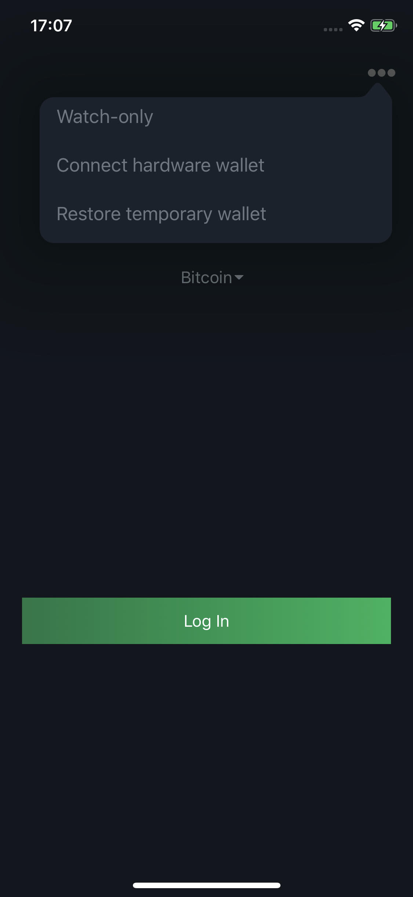

Hardware Wallets
================

.. contents:: Table of Contents
   :local:

Overview
--------

Blockstream Green multisig wallets can be used with hardware wallets. This gives you the
best of both worlds by combining Blockstream Green's multisig security with the private
key cold storage provided by a hardware wallet.

A Blockstream Green wallet associated with a hardware wallet creates a 2-of-2 multisig
wallet where one key is held on your hardware wallet, and the second key is held by the
Blockstream Green service. The second key serves to authorize transactions through
Two-Factor Authentication.

.. attention::
   When you create a new Bitcoin wallet with your hardware wallet on Blockstream Green, it
   will be different from:
   
   * Any wallet previously created on the hardware wallet
   * Any wallet previously created in Blockstream Green

Supported Hardware Wallets
--------------------------

We're constantly working to add support for more hardware wallets in Blockstream Green.
For the latest support status updates, follow the
`Blockstream Twitter <https://twitter.com/blockstream>`_ or regularly check the table below.

.. note::
   To share feedback or support requests, join the Blockstream Green
   `community channel <https://t.me/blockstream_green>`_ or 
   `contact support <https://docs.blockstream.com/green/support.html>`_.

+-------------------+--------------------------------------------------------------------------------------------------------+
| Supported Devices | Support Type *                                                                                         |
+===================+==================================+==================================+==================================+
|                   | **Android (USB)**                | **Android (Bluetooth)**          | **iOS (Bluetooth)**              |
+-------------------+-----------------+----------------+-----------------+----------------+-----------------+----------------+
|                   |*Bitcoin Mainnet*|*Liquid Mainnet*|*Bitcoin Mainnet*|*Liquid Mainnet*|*Bitcoin Mainnet*|*Liquid Mainnet*|
+-------------------+-----------------+----------------+-----------------+----------------+-----------------+----------------+
|*Trezor One*       | ✓               | x              | x               | x              | x               | x              |
+-------------------+-----------------+----------------+-----------------+----------------+-----------------+----------------+
|*Trezor T*         | ✓               | x              | x               | x              | x               | x              |
+-------------------+-----------------+----------------+-----------------+----------------+-----------------+----------------+
|*Ledger Nano S*    | ✓               | ✓ **           | x               | x              | x               | x              |
+-------------------+-----------------+----------------+-----------------+----------------+-----------------+----------------+
|*Ledger Nano X*    | ✓               | x              | x               | x              | ✓               | x              |
+-------------------+-----------------+----------------+-----------------+----------------+-----------------+----------------+
| \* Support only includes 2-of-2 multisig wallets. Singlesig 1-of-1 wallets are not currently supported.                    |
|                                                                                                                            |
| \*\*Only available with developer mode turned on in Ledger Live.                                                           |
+----------------------------------------------------------------------------------------------------------------------------+

Hardware Wallet Setup
---------------------

Video Guide
^^^^^^^^^^^

.. raw:: html
   
   <iframe width="560" height="315" src="https://www.youtube.com/embed/nkQ_LXEuSVg"
   frameborder="0" allow="accelerometer; autoplay; encrypted-media; gyroscope;
   picture-in-picture" allowfullscreen></iframe>

Step-by-step Guide
^^^^^^^^^^^^^^^^^^

Here are detailed instructions for using each type of hardware wallet that supports Blockstream Green. 

Part 1: New Wallet Setup and Login
~~~~~~~~~~~~~~~~~~~~~~~~~~~~~~~~~~

**Step 1**: To use a hardware wallet with Blocsktream Green, first initialize the hardware
device according to the manufacturer’s instructions.

**Step 2**: Safely record and store the hardware device’s mnemonic and PIN that were
created in the previous step.

**Step 3**: Connect your hardware wallet to Green.

* For USB hardware wallets: Plug in the hardware wallet into the Android device that has a
  Blockstream Green wallet installed and open Blockstream Green.

.. note::
   The Blockstream Green app can be opened before or after plugging in the hardware device.

* For Bluetooth hardware wallets: Turn your hardware wallet on, open Green and tap on
  **Connect hardware wallet** via the top right menu on the login page (see below), then
  follow the instructions on Green to pair your hardware wallet.

**Step 4**: Enter the hardware wallet’s PIN.

* For Trezor One, enter the PIN through the smartphone with the hardware wallet’s onscreen
  keyboard guide.
* For Ledger Nano S, enter the PIN and open the Bitcoin application to login.

Congratulations, you are now logged into your 2-of-2 Blockstream Green wallet.

.. note::
   If you didn't have an existing Blockstream Green wallet associated with this hardware
   wallet device, a new 2-of-2 wallet will be created. If you had already logged into a
   Blockstream Green wallet with your hardware wallet, you will be automatically logged
   back into it.

Part 2: Using Blockstream Green with a Hardware Wallet
~~~~~~~~~~~~~~~~~~~~~~~~~~~~~~~~~~~~~~~~~~~~~~~~~~~~~~

Log into your Blockstream Green wallet by completing the setup and login instructions in
the preceding section.

When sending transactions, the hardware wallet will ask to confirm the transactions.

After confirming transactions with the hardware wallet, a Two-Factor Authentication code
(which we strongly advise you to set up) will be required.

Part 3: Restore a Blockstream Green Wallet Created with Hardware Wallet
~~~~~~~~~~~~~~~~~~~~~~~~~~~~~~~~~~~~~~~~~~~~~~~~~~~~~~~~~~~~~~~~~~~~~~~

In the event that a hardware wallet used to log into a Blockstream Green wallet is lost or
broken, there are two options for restoring the Blockstream Green wallet.

**Option 1**: Restore the Blockstream Green wallet on a new hardware wallet using the
backup mnemonic ("recovery seed", "recovery phrase") created when the old hardware wallet
was setup. Follow the hardware wallet manufacturer's instructions to restore the backup
mnemonic. Then run Blockstream Green starting with **Step 3** from the preceding
**New Wallet Setup and Login** section.

**Option 2**: Restore the Blockstream Green wallet by entering the backup mnemonic created
when the old hardware device was setup via the **Restore Green Wallet** button on the
Blockstream Green onboarding screen.
