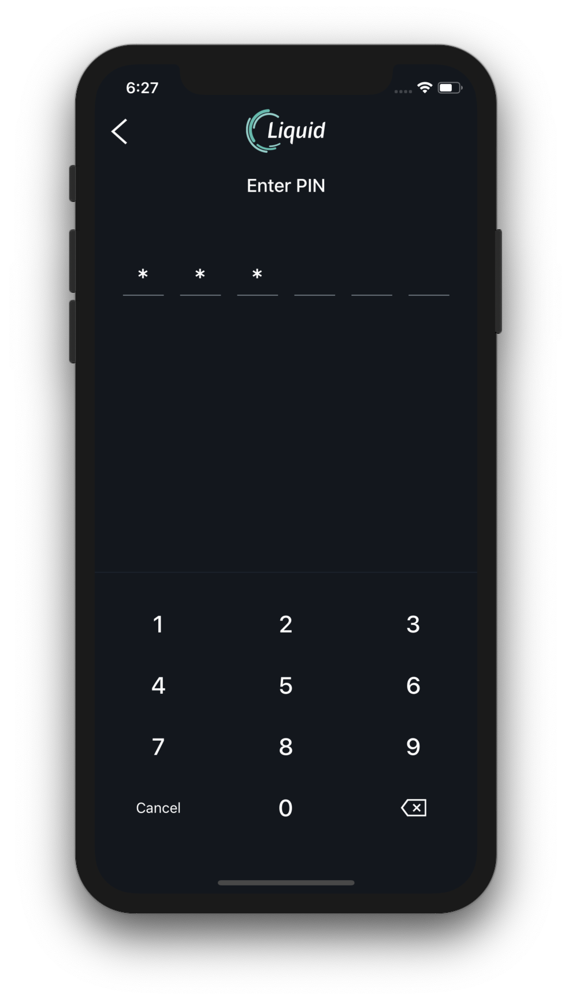
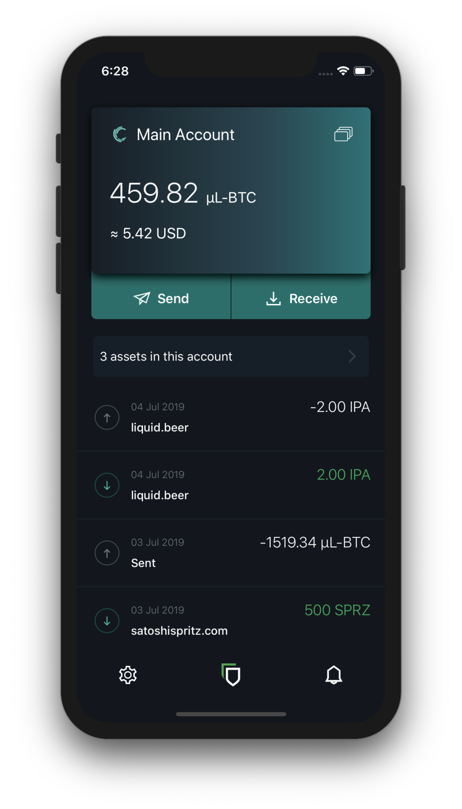
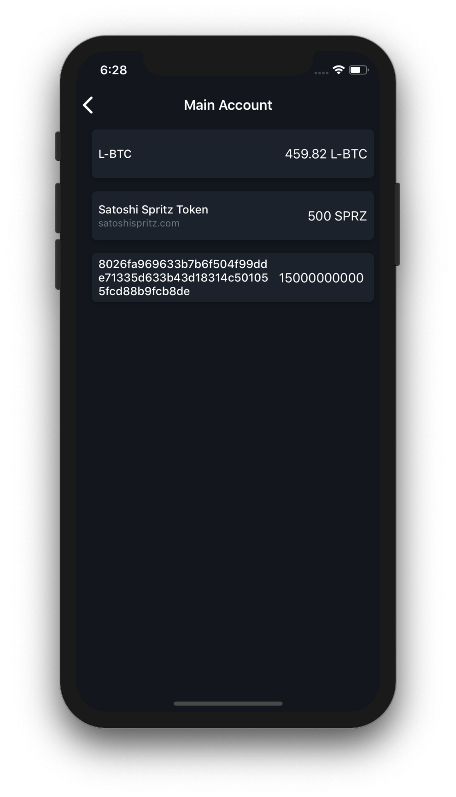
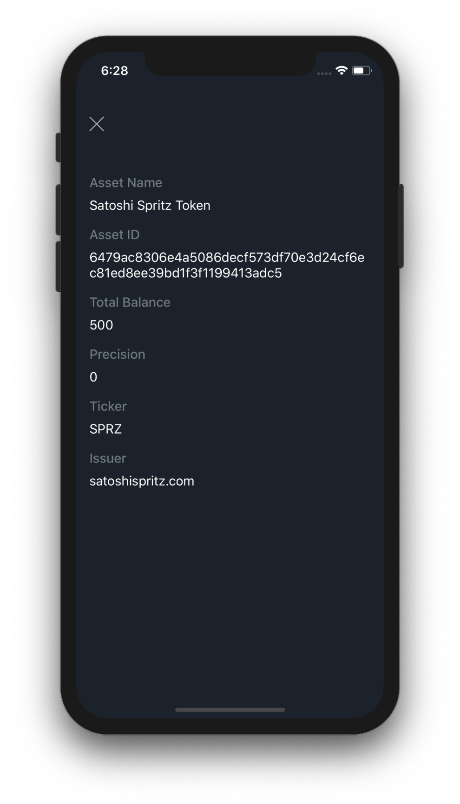
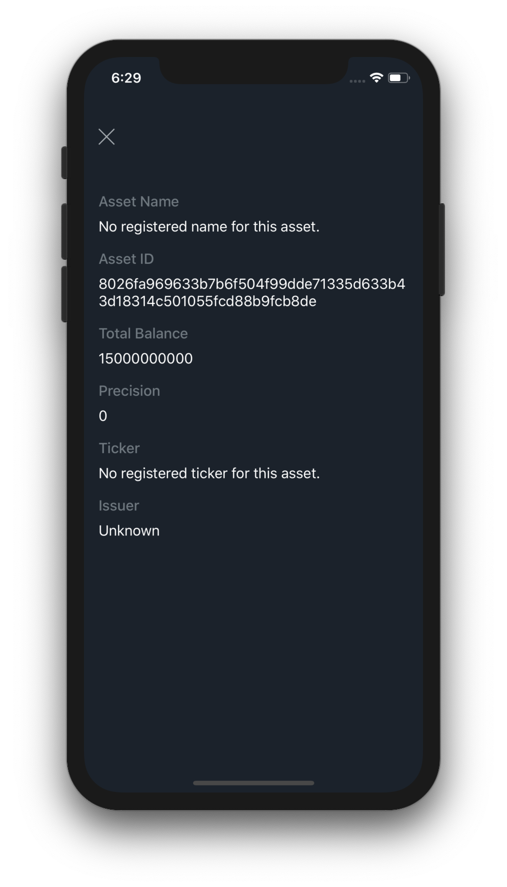
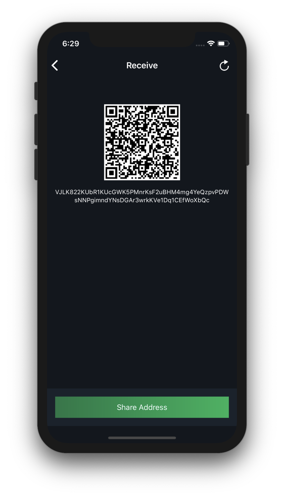
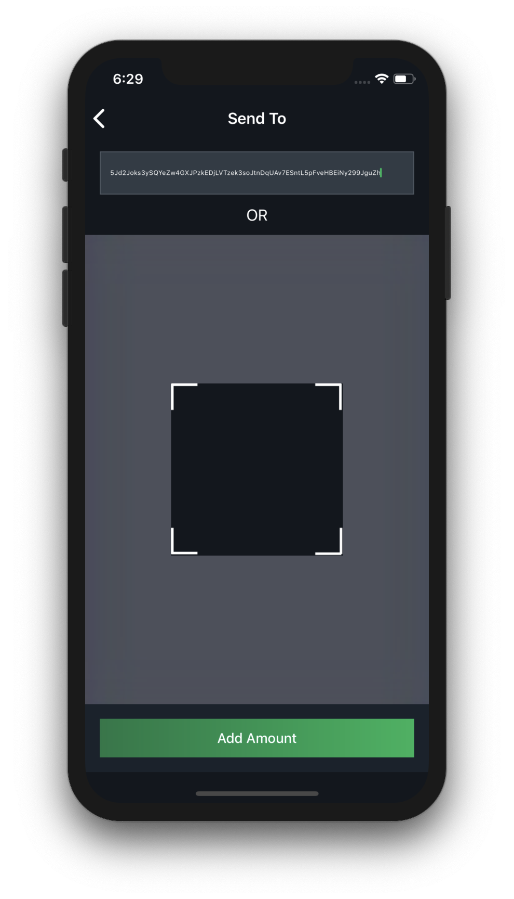
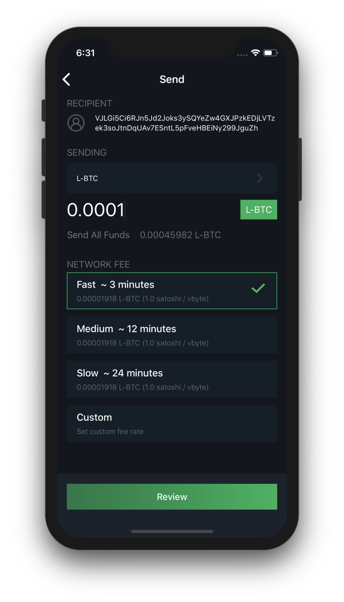
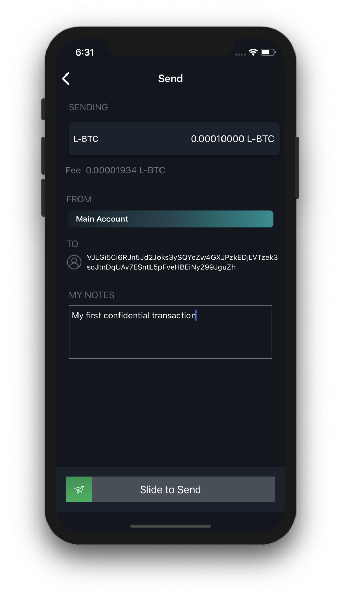

Basic Usage
===========

Logging In
----------

When opening the app, you will be presented with a login screen prompting you to input
your PIN for the Liquid Network (or for the last accessed network).

.. attention::
   If you have forgotten your PIN, you will need to enter your 24-word mnemonic to access
   your wallet. After you have done this, you will be prompted to create a new PIN to
   easily access the wallet you just restored.

You will also need to access your wallet with your mnemonic if you or someone else has
incorrectly entered your PIN 3 times in a row. In this scenario, your app will reset your
PIN and require your mnemonic. This is a security feature to prevent a malicious party
from continually guessing your PIN until they get it right.

Balance and Transaction List
----------------------------

The main screen you will be using in Blockstream Green will display your wallet’s balance
in Liquid Bitcoin (L-BTC) and its approximate value in the reference fiat currency you
selected from settings.

Directly below this will be the `send <liquid-index.html#sending-transactions>`_ and
`receive <liquid-index.html#receiving-l-btc-and-issued-assets>`_ buttons.

Beneath these, you can find a button ``X assets in this account``, tap on it to 
`go to the asset list <liquid-index.html#asset-list>`_.

You can also view from this screen all of your wallet’s incoming and outgoing
transactions. Transactions are listed in reverse chronological order, starting with the
most recent transactions at the top.

You’ll be able to see the date, time, amount, and confirmation status of any transactions.
Transactions involving assets other than L-BTC will display a 3/4 characters ticker next
to the amount, depending on whether the issuer registered his asset on the
:ref:`Asset Registry <to-issued-assets>`.

You can also select any transaction to get more information about it, such as the assets
involved in the transaction, or the Transaction Hash, which can be used as a
proof-of-payment.

Asset List
----------

From this page you can check the balance of every asset you have in the account you
navigated from.

Depending on what you possess you may see mainly 3 types of
:ref:`issued assets <to-issued-assets>`:

   - L-BTC, the Liquid Bitcoin native asset, 1 L-BTC corresponds to 1 BTC thanks to the
     :ref:`peg-in mechanism <to-sidechain-basics>`.
   - Labeled assets with human readable names, you can check more info by tapping on the
     asset card to see the asset details. Only assets
     submitted by their issuers to the :ref:`Asset Registry <to-issued-assets>` have
     human readable, non-editable labeling data by default.
   - Unlabeled assets identified by a 64 hexadecimal characters-long string, and with no
     denomination Ticker. In the next upgrade you'll be able to customize these "raw
     assets" with labeling data of your choice by tapping on the asset card to edit the
     asset details.

Asset Details
-------------

Depending on whether the asset's issuer registered the asset or not, you will see the non-
editable `asset data <liquid-index.html#registered-assets>`_ or just the
`raw identifier of the asset and the customizable fields <liquid-index.html#raw-assets>`_
to label the asset yourself.

Registered Assets
^^^^^^^^^^^^^^^^^

Here you can see a series of metadata defined by the asset issuer:

   - the official Name of the asset,
   - the Asset ID, a 64 hexadecimal characters long unique identifier of the asset, used
     on the network to identify the asset,
   - the Total Balance of the asset that you currently own in your wallet,
   - the decimal Precision, which defines how many satoshis of an asset should be
     interpreted as a whole unit. A 2 decimals precision would imply that 199 satoshis of
     an asset should be displayed as 1.99. Your wallet already displays all the amounts of
     each asset using the precision specified under this field.
   - the Ticker is a 3 or 4 characters shortening of the asset name, used to denominate
     all of the amounts of this asset with a recognizable abbreviation,
   - the Issuer domain, which is used to tie together all of the above information to the
     issuing entity that also controls the domain submitted to the registry. This
     information is critical for the user to visually validate that an asset with a
     certain Name and a specific Ticker really belongs to the right issuer.

Raw Assets
^^^^^^^^^^

Issued Assets without a record on the Asset Registry will not have the same richness in
information as registered assets.

You can anyway see a very important piece of information, which is the Asset ID. This 64
hexadecimal characters long string is the unique identifier of any asset, and you should
always check with the asset issuer that you received an asset that matches their specified
Asset ID. The asset issuer should always publish the ID of any asset they issue, otherwise
anyone could cheaply create a bogus asset and defraud you by sending a worthless asset.

Receiving L-BTC and Issued Assets
---------------------------------

To receive Liquid Bitcoin or any other Issued Asset, all you need to do is provide a
receiving address to the sender.

A Liquid receiving address is a string of numbers and letters. You can create a receiving
address by selecting “Receive” from the main screen. 

All addresses in Liquid are, by default, blinded using
:ref:`Confidential Transactions <to-confidential-transactions>`. Blinding is the process
by which the amount and type of asset being transferred is cryptographically hidden from
everyone except the sending and receiving parties.

Your wallet will generate a new receiving address each time you prompt it for one. While
it is possible to reuse old addresses, we strongly advise against this because it lessens
your privacy.

Once you can see what your new address is, you’ll need to communicate it to the sender.
If you need to send over a distance, a text message or email is an effective way to do it.

.. tip:
   It’s always better to copy and paste addresses rather than manually type them out, and
   you should also double or triple check every time, especially for larger amounts. If
   the address is wrong, any asset sent can become lost forever, so be very careful!

If you are physically beside the person who will be sending you Bitcoin, another option is
to use the QR code, which the sender can scan to get the receiving address. This is really
convenient if the sender is using a mobile wallet.

Once someone has sent a transaction to your Blockstream Green wallet, it should appear in
your transaction list page. At first, it will be labelled “unconfirmed”. 

Transactions on Liquid are :ref:`settled with finality after 2 blocks <to-blocksigner>`,
therefore you can consider your funds to be finally received within 2 or 3 minutes,
under normal network conditions.

Sending Transactions
--------------------

To send a transaction, select “Send” from the main screen.

You will need to get the receiving address from the recipient, and enter it (either by
typing or pasting it in, or by scanning the receiver’s QR code).

Then, you can select the asset you wish to send and input the amount that you want to send
, and hit send.

Your wallet will also automatically calculate a fee for your transaction, which is
necessary to have the network accept it and to avoid Denial of Service.

Finally you can review your transaction and send it after confirming your Two-Factor
Authentication.

After you have sent a transaction, it will be :ref:`settled with finality after 2 blocks
<to-blocksigner>`, therefore your counterparty will receive the funds within 2 or 3 
minutes, under normal network conditions.

Our Multisignature Model
------------------------

Blockstream Green wallets use a special transaction format different from most other
Bitcoin wallets.

Most other storage services in Bitcoin are either “custodial” or “non-custodial without
*Two-Factor Authentication* security”.

Custodial services, such as exchanges, hold your Bitcoin for you. This also means that
they can confiscate your coins at will, or if they get hacked, your coins can get stolen.
It also usually means KYC identification, and risks of privacy loss.

Other non-custodial wallets do not have those issues, but it also means that if someone
steals your mnemonic or gain access to your wallet, they can steal all of your coins.
The secrecy of your mnemonic is the only thing protecting your coins with these wallets.

With Blockstream Green, you get the benefits of both types.

This is possible because coins in Blockstream Green wallets have two different spending
conditions.

The first way to spend coins is using signatures from 2 different keys to send coins. One
is held by the user in the form of the mnemonic, which the service  never knows. The other
is stored on our server, and we sign your transactions with it after any *Two-Factor
Authentication* you have enabled verifies the transaction.

This means that, unlike custodial solutions, we can never steal your coins, since we don't
know your mnemonic. Even if we get hacked, or taken over by a government entity, or
something else catastrophic happens, no one can steal your coins.

On the user side, even if someone steals your mnemonic, they cannot spend your coins
unless they can access your *Two-Factor Authentication*. This is the type of security that
other wallets do not offer.

The second way to spend coins becomes available after your two factor recovery period
expires. Once this happens,  you can spend your coins without our service needing to also
sign. This is to ensure that no matter what happens, you can always get your coins back

Redeposits
----------

As explained above, coins in your main Blockstream Green wallet (or a 2of2 simple account)
require 2 signatures to be spent: one from you and one from Blockstream Green. In order to
protect you from loss of access to your coins should Blockstream Green become unavailable,
there is an alternative spend condition which requires only the user’s signature, provided
that a certain period of time has passed.

If the service becomes unavailable, you simply wait for the specified period (65535 blocks
on Liquid, circa 45 days days, by default), then sign and send the transaction using our
open source recovery garecovery_.

.. _garecovery: https://github.com/greenaddress/garecovery

After the expiry period passes, any limits placed on your spending in Blockstream Green,
such as *Two-Factor Authentication* requirements, cease to be enforceable by the service.

At this point the wallet will prompt you to redeposit the coins by sending them to
yourself (If you don’t log in to the wallet during this time, and you have email
notifications enabled, the service will email you a reminder as the expiry date gets
closer). The confirmation of the redeposit transaction resets the expiry period, thereby
re-protecting the coins by once again requiring a Blockstream Green signature to spend
them.

Keep in mind that this redeposit transaction is a regular Liquid transaction, and as such
is subject to the usual network fees.