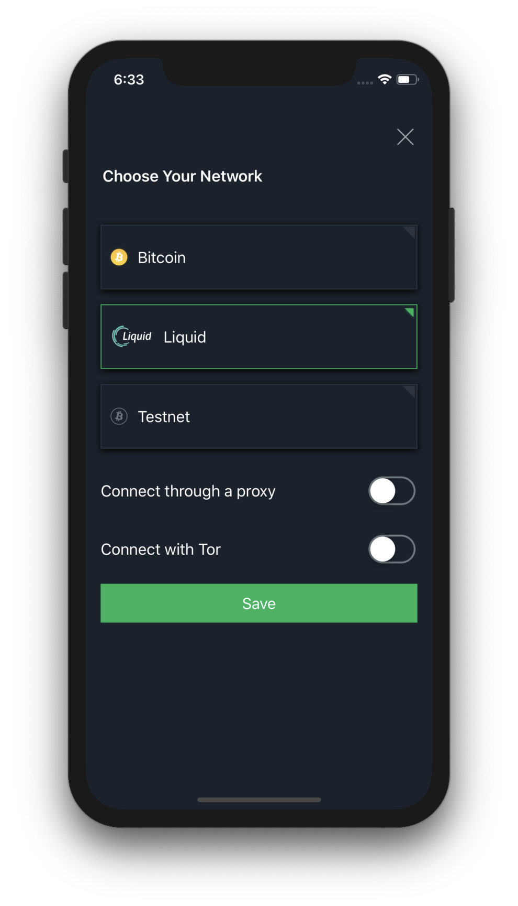

Setting Up a Liquid Wallet
==========================

Your privacy is preserved, while your funds are 2FA secured
-----------------------------------------------------------

The Green server is able to authorize and sign your transactions – upon 2FA verification –
without knowing anything about the asset or the amount you are sending, or receiving on
`standard accounts <liquid-index.html#standard-account>`_.

The only information available to Green servers is the list of the confidential outputs
you own. These outputs are served to your wallet, and only the client on your device is
able to unblind these outputs and to compute the total balances of your assets, or to
create transactions.

`Liquid securities accounts <liquid-index.html#liquid-securities-account>`_ are an
exception, as the issuer needs to be able to know whether the recipient of a Liquid
security transaction is an authorized investor.

Switch Network to Liquid
------------------------

To create or restore a Liquid wallet, change network by tapping on the network name in the
center of the landing page e.g. `Bitcoin` in the image below.

.. note::
   If you have an existing wallet protected with PIN, tap on the back arrow on the top
   right to reach the landing page, or switch network from settings after login.

.. image:: ../green-assets/landing.png
   :width: 250
   :align: center

Select Liquid among the available networks and then tap on the ``Save`` button.

Then tap on ``Create New Wallet`` and follow the process to
:ref:`create a new wallet <to-create-wallet>`, just like you would do for a standard
bitcoin wallet, or tap on ``Restore Green Wallet`` and insert a *mnemonic for a Green
Wallet you previously created on Liquid*.