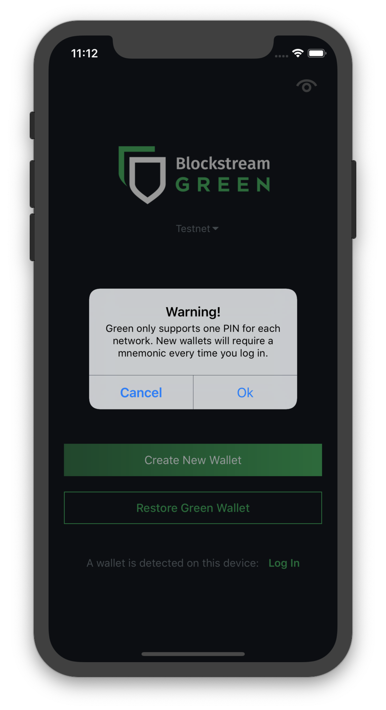

----------------------------
Multiple Wallets and Devices
----------------------------

Managing a Single Wallet Across Multiple Devices
------------------------------------------------

One of the many advantages of using Blockstream Green is that you get multi-platform
support - you can access your wallet from different devices on different operating systems
.

To do this, you need to first have a wallet created (on any one of our apps), and have the
mnemonic carefully recorded.

Now, install any version of our app on the secondary device that you wish to use. Once it
is installed, do not create a new wallet. Instead, tap on `Restore Green Wallet` and enter
your 24-word mnemonic from your original wallet.

.. image:: ../green-assets/landing.png
   :width: 250
   :align: center

After this, the app will ask you to create a PIN (if there is no other PIN-protected
mnemonic on your device).

.. note:: It is important to understand that this is not the same PIN that you use to
   enter your wallet in the original device. Each device can be set up with its own PIN.
   The mnemonic is common to all devices accessing the same wallet and coins, but each PIN
   is specific to the device it was created on.

Once you have done this, you can freely access your coins from either device, and make
changes as you please. Also, any coins sent or received on one device will be reflected in
all other devices connecting to that same wallet.

Managing Multiple Wallets on a Single Device
--------------------------------------------

It is also possible to use a single device and app to access different wallets created by
the app’s user.

.. caution:: Keep in mind, that managing multiple wallets on a single device will mean
   carefully managing a separate 24-word mnemonic for each wallet. It is already
   imperative that you keep any mnemonic safely and secretly recorded, but managing
   multiple wallets will make very clear as to why!

.. image:: ../green-assets/landing.png
   :width: 250
   :align: center

Imagine that you have created your first wallet (A) and you access it via PIN.

Now, you want to create a separate wallet (B). You do this by clicking on ``Create New
Wallet`` on the bottom of the *Onboarding* page.

When you do this, you will be warned that **you can only have one PIN-protected mnemonic
at one time on a network**. If you continue, your mnemonic is the only means you have to
recover your wallet as you will not be able to set a PIN.

- If you press ``OK`` you will be guided through the new wallet setup process, but you 
  **will not be able to set a PIN** for this wallet, and you will be able to access it by
  typing the 24-words mnemonic from the ``Restore Green Wallet`` in the "Onboarding"
  screen every time.

- If you want to access this new wallet (B) via PIN, you first need to erase the existing
  PIN for wallet (A). This entails being able to access wallet (A) only by typing its
  24-words mnemonic via  the ``Restore Green Wallet`` in the *Onboarding* screen.

     1. Delete the PIN for wallet (A):

         - either by accessing wallet (A) via PIN, and erasing PIN from settings,
         - or by inputting a wrong PIN 3 times.

     2. Go back to the *Onboarding* screen, and create or restore wallet (B).

.. tip:: Now, some of you may note that this isn’t all that convenient, having to re-enter
   your mnemonic each time you switch wallets.
  
   That is correct; it’s not a function that we generally recommend our users to use.
   Instead, if you wish to keep several different accounts for different groups of coins,
   we recommend that you use our simple account feature.