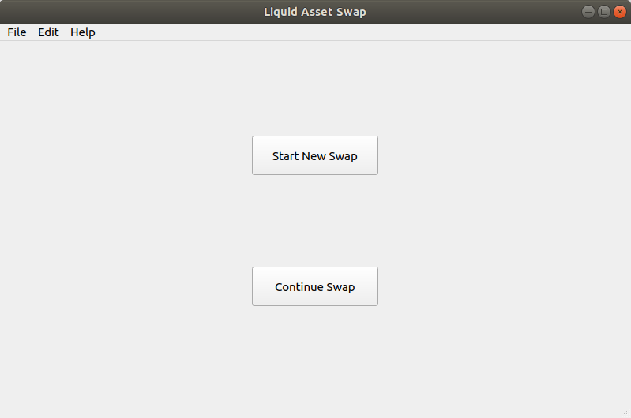

.. _swap_tool:

Liquid Swap Tool
****************

Liquid Node Preparation
-----------------------

If you have not already installed and run Liquid on your machine, follow the :ref:`Liquid Quickstart Guide <quickstart>` before continuing.

Once you have Liquid installed and running on your machine, you need to tell Liquid to allow connections from other applications, such as the Liquid Swap Tool.

To do this, follow the process in :ref:`Configuring Liquid <quickstart_configuring>` to locate and edit the Liquid config file and add the following line to the liquid.conf file:

``server=1``

After you have saved the change to the liquid.conf file you can start your Liquid node and it will be ready to accept connections from the Liquid Swap Tool.

Downloading and running Liquid Swap Tool
----------------------------------------

After you have prepared your Liquid node to accept connections from other apps, you can download the Liquid Swap Tool binaries from `https://github.com/Blockstream/liquid-swap/releases <https://github.com/Blockstream/liquid-swap/releases>`_.

To run Liquid Swap Tool using the binaries, please note the instructions for your operating system below.

Linux
=====

.. |br| raw:: html

     

1. Download and extract the files.
|br| |br| 
2. Run the tool from the extracted file location using the command line:

   ``liquidswap-gui``
   
   or
   
   ``liquidswap-cli``

MacOS
=====

1. Download the .zip file and double click to extract the contents.
|br| |br| 
2. Open the newly extracted folder and double click the ".dmg" file and, when prompted, drag the Liquid Swap Tool to the Applications folder.
|br| |br|
3. Go to the Applications folder and double click the Liquid Swap Tool to run it. If you get an error saying the file is not from the App Store:

   3.1 Open System Preferences then Security & Privacy and then click on the General tab.

   3.2 Click the "Open Anyway" button next to the mention of Liquid Swap Tool.

   3.3 A new window will open allowing you to select "Open the Liquid Swap Tool".

Windows
=======

1. Download the installation file and double click to run the Liquid Swap Tool setup.
|br| |br|
2. Run the installed Liquid Swap Tool from the Programs menu.

Using Liquid Swap Tool
----------------------
The Liquid Swap Tool can generate, check and sign Liquid asset swap data. The data it generates during the swap process must be exchanged between the two parties outside of the tool itself. The swap data is just plain text and can be copied and pasted into whatever communication method the two parties choose to use.

In this guide, we'll refer to the person who initiates the swap as the Proposer, and the party on the other side of the swap as the Respondent. We'll be swapping some ``L-BTC`` for ``USDt``.

The Proposer starts the swap by clicking ``Start New Swap``.

The Proposer then selects the asset and the amount of the asset they will send, the asset and amount of that asset that they would like to receive in return. 

.. image:: ./artwork/swap_tool/swap02.png
   :align: center

* The drop down list of assets that can be sent is populated with assets that are currently held in your local Liquid node's wallet. Either the asset id or the asset label is displayed, depending on if a label has been set. Information on using labels can be found `here <https://elementsproject.org/elements-code-tutorial/issuing-assets>`_. The ``L-BTC`` label is mapped by default to the L-BTC asset. 

* The receive asset drop down also contains assets currently held in your local wallet. You can add a new asset (for example, one that you have yet to receive) by pasting in the asset id from the person who wants to send it to you. You can cross-reference the asset id against `Blockstream's Liquid Asset Registry <https://assets.blockstream.info/>`_ if the asset has been registered by the original issuer.

The ``Add New Asset`` button can be used to map an asset id that you do not yet have in your wallet to a label. This makes it easier to perform swaps in the future without having to remember the id of individual assets each time. The example below shows how to map an asset with the id ``946cfcc80...`` to a local label of ``YourLocalAssetLabel``. Please be aware that the labels you create are not shared with others on the Liquid network, who will see either the asset id, or their own locally assigned asset label during the swap.

When the assets and amount have been entered, the Proposer then clicks the ``Generate Proposal`` button. 

The Proposer copies the generated proposal and sends it to the Respondent.

The Respondent will start their side of the swap by clicking ``Continue Swap`` within their Liquid Swap Tool, and pasting in the text the Proposer sent them.

The Respondent can then view the details of the proposed swap. If they decide to accept the proposal, they click ``Accept Proposal``, which gives them the chance to review the fees that will be paid, along with the address that they will receive funds to.

If the Respondent accepts the swap, they are presented with the signed acceptance data, which they have to send back to the Proposer. At this stage, the swap is not yet complete.

If the Proposer wants to complete the swap, they click ``Continue Swap`` from the Liquid Swap Tool's welcome screen, paste in the text the Respondent sent them, and verify the contents of the trade. If the Proposer accepts the swap, they click ``Execute Swap``, before finally confirming that they are willing to pay the fees needed for their part of the swap. 

The Liquid Swap Tool signs and broadcasts the transaction, completing the swap for both parties.

.. image:: ./artwork/swap_tool/swap04.png
   :align: center

For more information, refer to the `Liquid Swap Tool repository <https://github.com/Blockstream/liquid-swap/>`_.

Wallet Compatibility Notice
---------------------------

Please note that the Liquid Swap Tool is not compatible with some older Liquid wallet versions. If you receive an error informing you that you have an "unsupported wallet version" you will need to back up your Liquid wallet.dat file, generate a new wallet and send funds from the old wallet to the new wallet before opening the Liquid SwapTool again. Please ensure you follow accepted processes for doing this in order to prevent loss of funds.

