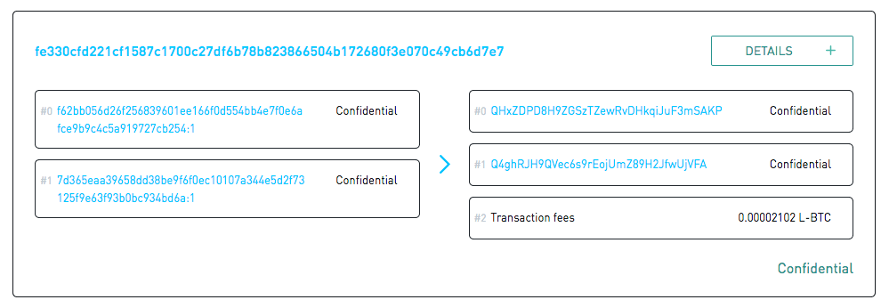

.. _technical-overview:

Technical Overview
******************

Liquid is a sidechain-based, inter-exchange settlement network linking together cryptocurrency exchanges and institutions around the world, enabling faster Bitcoin transactions and the issuance of digital assets. Liquid is an implementation of `Elements <https://elementsproject.org/>`_, an open source, sidechain-capable blockchain platform, based on the Bitcoin codebase.

Liquid provides Bitcoin exchanges and traders with a range of powerful features:

* **Fast, Final Settlements:** Bitcoin moved to the Liquid sidechain (Liquid Bitcoin, "L-BTC") can achieve final settlement within two minutes.
* **Confidential Transactions:** Amounts and type of asset transacted are hidden by default on Liquid, keeping users’ financial data safe.
* **Secure Tokenization:** New tokens can be issued on the Liquid sidechain (Issued Assets) to represent fiat, securities, or other digital assets.
* **Interoperability:** One Liquid integration provides support for both L-BTC and Issued Assets. All tokens are based on the same standard, allowing users to take advantage of features such as atomic swaps and Bitcoin-style multisig.

Liquid is built using open-source `Elements code <https://github.com/ElementsProject/elements>`_. This is why you download the application from the Elements
repository, execute commands against elementsd (daemon) and elements-cli (client), and edit things like the elements.conf config file.

As the Elements code defaults to using the live Liquid network, we'll be referring to installing and running Liquid, and not Elements, throughout the `docs.blockstream.info <https://docs.blockstream.com>`_ site.

.. _to-sidechain-basics:

Sidechain Basics
================

Liquid is a sidechain of Bitcoin that allows users of the Liquid Network to move Bitcoin between the two networks with a two-way peg. Bitcoin used in the Liquid Network is referred to as L-BTC, and each L-BTC has a verifiably equivalent amount of BTC secured by the Liquid members called functionaries.

A **sidechain** is a mechanism that allows tokens from one blockchain to be used securely in an independent blockchain which runs in parallel and uses a different set of rules, performance requirements, and security mechanisms. On a sidechain, one can move tokens back to the original chain through a two-way peg. Sidechains enable new functionality that may have security trade-offs or as a way to test new features that may not be ready for use on the parent blockchain.

Network Roles
=============

The Liquid Network is operated by its members - large exchanges and financial institutions that benefit from its use. Blockstream has no control of the network and serves only as a technology provider. With no single entity in control, there is no longer any single point of failure.

Liquid uses an approach to consensus called Strong Federations. A Strong Federation removes the need for costly Proof of Work mechanisms and replaces it with the collective actions of a group of mutually distrusting participants called functionaries.

.. _to-functionary:

Functionaries
-------------

These functionaries each serve two roles on the network - as *blocksigners* they operate the Liquid sidechain, and as *watchmen* they secure Bitcoins held by the Network.

.. _to-blocksigner:

Block Signer
^^^^^^^^^^^^

Liquid’s block generation occurs every minute. This means that Liquid’s block generation is more consistent than Bitcoin’s (which has probabilistic generation). Block signers keep track of the block height they have signed along with its parent and refuse to sign blocks that would result in a reorganization of more than one block. Once a block has been created, its parent block will never be reorganized from the longest chain, which is why Liquid transactions can be considered final once they receive two confirmations. Liquid transactions will settle between two and three minutes when the network is functioning normally.

Liquid’s federated model requires blocks to be signed by at least two-thirds of all block signers. Block signers take turns proposing a new block every minute in a round-robin fashion, and other functionaries sign that block after validating its contents. Blocks will be created every minute when the network is functioning normally. However, it is possible that network instability or missing functionaries can result in some block rounds being missed. When fewer than one-third functionaries are offline, the network can continue. When the offline functionary becomes the block proposer of a round, that round will fail, which will result in no block being created during that interval.

If one-third or more of the functionaries are no longer operating, blocks will no longer be signed and the Liquid blockchain will be frozen until at least two-thirds of the functionaries come back online. Once a quorum of functionaries are communicating, block creation will resume.

.. _to-watchmen:

Watchmen
^^^^^^^^

One of the two duties of a functionary is to serve as a watchman. In this role, the functionary is responsible for managing and securing the Bitcoin held by the federation.

.. _to_pegin:

Peg-in (Bitcoin to Liquid)
""""""""""""""""""""""""""

Moving funds from Bitcoin to Liquid is called a peg-in; a member of Liquid sends Bitcoin to an address generated by the Liquid client software and then creates a peg-in transaction on the Liquid Network to claim its equivalent Liquid Bitcoin (L-BTC) from the Liquid Network. A peg-in transaction requires 102 confirmations on the Bitcoin network before the funds can be claimed on the Liquid Network. This high level of security is required to protect all participants' funds in the event of a large block reorganization of the Bitcoin blockchain.

.. figure:: ./artwork/technical_overview/peg_in.png
   :width: 65 %
   :align: center

Peg-out (Liquid to Bitcoin)
"""""""""""""""""""""""""""

The peg-out process moves funds from Liquid back to the Bitcoin blockchain. These transactions are processed by the watchmen in batches, where each peg-out round takes an expected time of ~17 minutes to complete.

.. note::
	The peg-out process is non-deterministic with an expected processing time of 11 to 35 minutes depending on the network conditions, such as watchman status when user peg-out was initiated and number of other peg-outs pending to process.

For added security, the watchmen will only send Bitcoin to an address under the control of an authorized user. This is done through the use of a Peg-out Authorization Key (PAK). Functionaries control a list a of PAKs that can be updated throughout the network operation to determine which users are authorized to make a peg-out transaction. In order to protect Liquid from unauthorized withdrawals, it takes three days to update the PAK list. This allows the network to detect an attacker that is able to compromise a set of functionaries before the attacker is able to make a withdrawal to their own wallet. PAK entries are linked to a BIP32 (Hierarchical Deterministic) Wallet owned by the user. Liquid users create a peg-out transaction proving that their address is derived from one of the PAK entries without revealing any additional identifying information.

.. figure:: ./artwork/technical_overview/peg_out.png
   :width: 65 %
   :align: center

Emergency Recovery Procedure
""""""""""""""""""""""""""""

The watchmen require a greater than two-thirds threshold to spend funds in Liquid which provides sufficient security for byzantine fault tolerance. If one-third or more of the network is ever unable to continue operating, the network would stall and the funds held would be locked up forever. To avoid this, all funds held by the Liquid Network are also accessible by a set of three emergency keys when the network has been non-functional for thirty consecutive days. These keys cannot be used to spend any funds when the network is operating correctly. Two of the three emergency keys can then be used to access funds held by the Liquid Network so that they can be distributed back to their owners’ authorized wallets. These keys are held in separate, secure locations to avoid a single point of failure.

Hardware 
^^^^^^^^^

The functionary server itself consists of two components - the host server and a key storage module. The host is a standard server that is used to run a full Bitcoin and Liquid node and communicates with the other functionaries over Tor. Tor is used by the functionaries to ensure that all communications between the functionaries do not contain IP addresses which could lead to members of the network being subject to denial of service attack, and to avoid disclosing the physical location of the servers. The host is responsible for proposing blocks and staying in sync with each of the other functionaries. Attached to each host is a key storage module that is connected via a limited interface. No block signing or watchman key material is ever stored on the host to limit the ability of a remote attacker compromising the network. The host is configured to only allow incoming SSH connections when a button is pressed which allows for authorized users to connect and perform updates to the software or PAK list. This protection means that physical access to the functionary server is required to perform any changes.

The key module does additional validation before signing blocks or creating Bitcoin transactions. The key module also ensures that Bitcoin spent from the network only is spent to a set of authorized users.

It is recommended to have physical access restricted to the functionary server in order to avoid tampering. The functionary server must be installed on a private network with unrestricted outgoing connections. Liquid wallets and transactions are managed through separate Liquid node software that will connect directly to your functionary. 

.. _to-participant:

Participants
------------

The Liquid Network consists of a fixed group of functionary members that is defined at launch. Members without functionary hardware connect to the Liquid Network by using pseudo-functionary nodes that connect to all functionaries. Participant members can perform peg-ins, peg-outs, send Liquid transactions and fully validate the Liquid chain, without playing a role in securing the network.

General Public
--------------

Anyone can participate in the network by running a full node. These full nodes connect to the Liquid network via bridge nodes that are run by Functionaries and Participants members. Liquid full nodes allow users to trustlessly self-validate the chain just like with the Bitcoin Network and give its user free range ability to peg-in to the network, perform confidential transactions and make full use of the Issued Assets functionality.

.. Warning::
   General public does not have the ability to independently peg-out of the network, which means they require from a Functionary or a Participant member to convert L-BTC back to BTC.

+-------------------------------+----------------+--------------+---------------+
|                               |  Functionaries | Participants |General Public |
+===============================+================+==============+===============+
|Secures the Network            |      |yes|     |     |no|     |      |no|     |
+-------------------------------+----------------+--------------+---------------+
|Peg-in (BTC to L-BTC)          |      |yes|     |     |yes|    |      |yes|    |
+-------------------------------+----------------+--------------+---------------+
|Peg-out (L-BTC to BTC)         |      |yes|     |     |yes|    |      |no|     |
+-------------------------------+----------------+--------------+---------------+
|Send Confidential Transactions |      |yes|     |     |yes|    |      |yes|    |
+-------------------------------+----------------+--------------+---------------+
|Issue Assets                   |      |yes|     |     |yes|    |      |yes|    |
+-------------------------------+----------------+--------------+---------------+

Liquid Use Cases
================

Confidential Transactions
-------------------------

Liquid uses Confidential Transactions, which hides the amounts and asset types within transactions from all third parties. This information is only known by the parties involved in the transaction and other third parties they designate. Liquid transactions use confidential addresses that include a public blinding key and a base address. Only the receiver alone can decrypt the amount sent in a transaction. The receiver can share the private blinding key with any third party in order for that party to be able to validate the amount and asset type.

Liquid transactions include a transaction fee that is used as a denial of service protection mechanism. Transaction fees are a minimum value of 1 satoshi/vbyte, but can rise if network congestion increases. Liquid transactions are larger than similar Bitcoin transactions due to “range proofs” that must be included in Confidential Transactions and are used to prove that no outputs are negative values.

.. _to-ct-limit:

The implementation of Confidential Transactions in Liquid has important limitations regarding the amounts of transactions that will be protected: amounts are only completely hidden up to a certain maximum. The reason for this is that a larger maximum would require larger proofs leading to a larger overall transaction size and lower transaction throughput. The exact limit is 2^36 - 1 satoshis or about 687 BTC. Any transactions that try to exceed this limit will have to be split into seperate transactions.

.. _to-issued-assets:

Issued Assets
-------------

Liquid allows for users to create and transfer other assets using a feature called Issued Assets (IA). These assets can enable applications such as tokenized fiat, tokenized non-BTC cryptocurrency, digital collectibles, reward points and attested assets (e.g. gold coins). The obligations under an IA belong to the issuer and Liquid does not verify whether the underlying asset exists or is properly maintained (in contrast to the BTC peg-in procedures).

Issued Assets in Liquid are given a unique identifier (64 hexadecimal characters) when created. This is the only identifying information of the Issued Asset explicitly recorded on the Liquid blockchain. Any additional human readable metadata to ease Issued Assets recognition at the UI level, can be committed to during the issuance, and is published on servers such as the `Asset Registry`_. The metadata that can be linked to an asset can be:

   - an extended name, up to 255 characters (e.g. "IPA pint - liquid.beer"), to give a human readable name to the Issued Assets
   - a 3 or 4 characters ticker (e.g. "IPA"), used to denominate the amounts in a recognizable unit,
   - the decimal precision, mainly useful for issuers. For instance, 2 places of decimal precision would mean that 199 satoshi of the Issued Asset should be interpreted as 1.99 units of the asset,
   - a domain that must be controlled by the issuer (e.g. "liquid.beer"), which is used to tie together all of the above information to the entity that also controls the domain submitted to the registry.

Each asset type can optionally be configured to allow reissuance by generating reissuance tokens when it is created. Assets in Liquid can also be also be verifiably destroyed by their owner to reduce the supply.

The reissuance tokens are used to prove authority and reissue more of the newly created asset at a later date. These tokens can be set up with a multisignature scheme generally described as being "m of n". That means that the reissuance transaction requires a group of "m"  keys in order to create new tokens. 

Issued Assets can be used for many different purposes, but some of the most commonly requested ones include tokenized fiat, tokenized equities, and tokenized cryptocurrencies.

.. _`Asset Registry`: https://assets.blockstream.info/

Security Tokens
---------------

Liquid's Issued Assets feature allows for the creation of tokens representing tradable financial assets, often referred as securities. These securities can represent things like debt securities (bonds), equity securities ( stocks), or derivatives (futures, options, and swaps). The development of securities tokens on Liquid could involve the combination of smart contracts on chain or other off chain techniques. Issuers of security tokens on Liquid would benefit from Liquid's security, reliability, privacy, and scalability.

Stablecoins (Tokenized Fiat)
-----------------------------

In this scenario, fiat currency is deposited in a bank account and held in trust of an issuer. The issuer generates tokens in Liquid representing the amount of money in that account and distributes the tokens to the depositors of the account. If the owner of one of these tokens wishes to receive fiat currency in return for it, he may redeem through the issuer. The issuer can then destroy the token and maintain an equal supply of fiat currency and outstanding tokens. As more fiat currency is deposited into the account, additional tokens can also be issued by the issuer. The issuer can prove to any auditor or regulator that the amount of outstanding tokens always matches the balance of the bank account. Issuers can also choose to use the scripting feature of Liquid to comply with different regulations around the world without adding any artificial requirements to the functionaries. 

Tokenized Cryptocurrencies
--------------------------

While Liquid supports Bitcoin through its Federation, other cryptocurrencies are not natively supported. Very few cryptocurrencies have the track record for stability and security as Bitcoin and it would be risky to include them as part of the consensus rules of the system. Instead, Liquid members can create a token that represents a collateralized cryptocurrency. These tokens can now be traded and settled between Liquid users with the same speed and privacy as Bitcoin and other Issued Assets. This approach also allows exchanges and traders to safely handle these assets without ever needing to support the underlying asset. This removes the amount of work needed to support extra blockchains and clients when supporting other assets. Owners of these tokens could then take the issued token and redeem it from the issuer. This opt-in model allows for users who wish to benefit to work with parties they trust to issue and secure the assets without requiring the entire federation to know about the asset.

Unique Tokens and Digital Collectables
--------------------------------------

Liquid can be used to track unique items such as ordered prints by an artist or digital collectables like a set of CryptoLions. You can track unique assets using Issued Assets by issuing a single individual token for each individual asset. The issuer would then keep track of the asset ids that are created and provide a registry to help identify which asset is associated with which digital collectable. There is no way to natively categorize or group assets in Liquid, although wallet software could support this use case.

Allowing Rapid Transfer of Funds
--------------------------------

Using Liquid, exchanges may offer the ability for their users to quickly and privately deposit and withdraw funds. To do this, exchanges will hold a portion of funds on the Liquid Network. When a user wishes to deposit on an exchange, they will request a Liquid deposit address to be generated on their behalf by the exchange. The exchange will then generate a unique Liquid deposit address for this customer. The customer will then take this address to another exchange and request a Liquid withdrawal. The sending exchange will deduct the balance of the customer and send the funds through Liquid to the receiving exchange. When the transaction receives two confirmations, the receiving exchange can credit the user's account without the risk of having a double-spend, typically in less than three minutes from when the original transaction was sent.

Institutional Traders
---------------------

Without Liquid, traders must split their funds allocated on different exchanges in order to take advantage of advantageous situations that may emerge within markets. This leaves the trader open to the risk of losing funds on a compromised exchange, and limits the amount that can be traded due to the elongated process of moving funds to another exchange.  Moving funds between an exchange can take over an hour, letting trade opportunities potentially slip away.

With Liquid, traders can hold their funds in their own wallet within Liquid and send very quickly to any exchange that supports Liquid deposits to trade within minutes. In this scenario, an exchange sees a trading opportunity at Exchange A and can quickly deposit in around 2 minutes onto an exchange. Once trading is complete, the trader can now move the funds back to their own Liquid wallet or to another exchange. Custodial risk is now moved from a single exchange to the entire Liquid federation.

